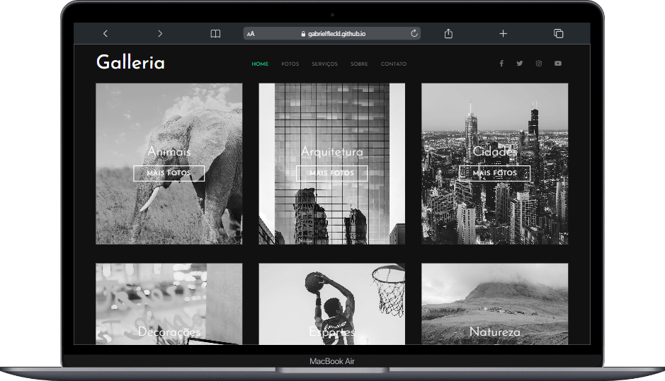

<h1 align="center">
  Galleria 🖼️
</h1>

  <a href="#-layout">Layout</a>&nbsp;&nbsp;&nbsp;|&nbsp;&nbsp;&nbsp;
  <a href="#-tecnologias">Tecnologias</a>&nbsp;&nbsp;&nbsp;|&nbsp;&nbsp;&nbsp;
  <a href="#-projeto">Projeto</a>&nbsp;&nbsp;&nbsp;|&nbsp;&nbsp;&nbsp;
  <a href="#-licença">Licença</a>&nbsp;&nbsp;&nbsp;|&nbsp;&nbsp;&nbsp;
  <a href="#-contato">Contato</a>

 

## 🎨 Layout

Aqui você pode conferir o layout em suas respectivas versões.  

[👉 Link para visualizar a pagina inteira](https://gabrielfleckl.github.io/projeto-galleria/)

### Versão Web 🖥️

 
   

---

## 🚀 Tecnologias

Esse projeto foi desenvolvido com as seguintes tecnologias:

 
 

	

## 💻 Projeto

Projeto desenvolvido para o aprendizado da tecnologia SASS e demais formas de usa-la, site em formato de galeria responsivo e dinâmico.

## 📝 Licença

Esse projeto está sob a licença MIT. Veja o arquivo [LICENSE](LICENSE) para mais detalhes.

## 🌐 Contato

---

Feito com ♥ by Gabriel Gonçalves 🖖
